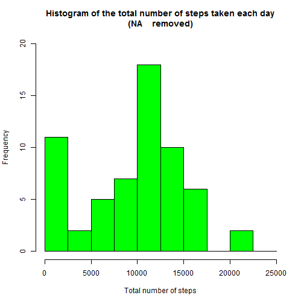
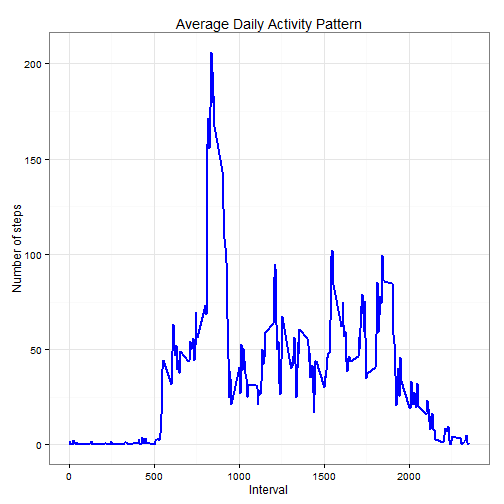
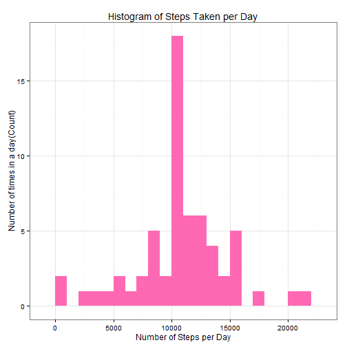
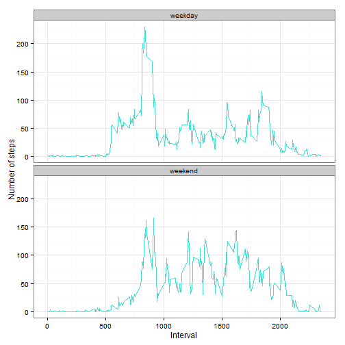

## Reproducible Research


```r
library(ggplot2)

library(knitr)
```


##Loading and preprocessing the data

1.Load the data (i.e. read.csv())


```r
data<- read.csv('activity.csv')
```


2. Process/transform the data (if necessary) into a format suitable for your analysis


```r
data$date <- as.Date(data$date, format = "%Y-%m-%d")
data$interval <- as.factor(data$interval)
```


# What is mean total number of steps taken per day?

1. Calculate the total number of steps taken per day


```r
sum_data <- aggregate(data$steps, by=list(data$date), FUN=sum, na.rm=TRUE)
names(sum_data) <- c("date", "total")
```
We display the first few rows of the average all days data frame:


```r
head(sum_data)
```

```
##         date total
## 1 2012-10-01     0
## 2 2012-10-02   126
## 3 2012-10-03 11352
## 4 2012-10-04 12116
## 5 2012-10-05 13294
## 6 2012-10-06 15420
```

2. Make a histogram of the number of steps taken each day


```r
hist(sum_data$total, 
     breaks=seq(from=0, to=25000, by=2500),
     col="green", 
     xlab="Total number of steps", 
     ylim=c(0, 20), 
     main="Histogram of the total number of steps taken each day\n(NA    removed)")
```

 


3. Calculate and report the mean and median of the total number of steps taken per day


```r
mean(sum_data$total)
```

```
## [1] 9354.23
```

```r
median(sum_data$total)
```

```
## [1] 10395
```

The mean is 9354.23 and the median is 10395.

# What is the average daily activity pattern?

1. Make a time series plot (i.e type = "1") of the 5-minute interval (x-axis) and the average number of steps taken, averaged across all days (y-axis)


```r
stepsperinterval <- aggregate(data$steps, 
                                by = list(interval = data$interval),
                                FUN=mean, na.rm=TRUE)

stepsperinterval$interval <- as.integer(levels(stepsperinterval$interval)[stepsperinterval$interval])
colnames(stepsperinterval) <- c("interval", "steps")
```

We display the first few rows of the average all days  data frame:


```r
head(stepsperinterval)
```

```
##   interval     steps
## 1        0 1.7169811
## 2        5 0.3396226
## 3       10 0.1320755
## 4       15 0.1509434
## 5       20 0.0754717
## 6       25 2.0943396
```

The time series plot is created by the following lines of code


```r
ggplot(stepsperinterval, aes(x=interval, y=steps)) +   
        geom_line(color="blue", size=1) +  
        labs(title="Average Daily Activity Pattern", x="Interval", y="Number of steps") +  
        theme_bw()
```

 


```r
mean(stepsperinterval$interval)
```

```
## [1] 1177.5
```

```r
median(stepsperinterval$interval)
```

```
## [1] 1177.5
```

These formulas gives a mean and median of 1177.5 and 1177.5 respectively.

2. Which 5-minute interval, on average across all the days in the datasets, contains the maximum number of steps?


```r
stepsperinterval <- aggregate(data$steps, 
                                by = list(interval = data$interval),
                                FUN=mean, na.rm=TRUE)
                
stepsperinterval$interval <- 
        as.integer(levels(stepsperinterval$interval)[stepsperinterval$interval])
colnames(stepsperinterval) <- c("interval", "steps")

max_internal <- stepsperinterval[which.max(stepsperinterval$steps),]

max_internal
```

```
##     interval    steps
## 104      835 206.1698
```


# Imputing missing values

1. Calculate and report the total number of missing values in the dataset


```r
missing_vals <- sum(is.na(data$steps))

missing_vals
```

```
## [1] 2304
```


2. Devise a strategy for filling in all of the missing values in the dataset


```r
na_fill <- function(data, pervalue) {
        na_index <- which(is.na(data$steps))
        na_replace <- unlist(lapply(na_index, FUN=function(idx){
                interval = data[idx,]$interval
                pervalue[pervalue$interval == interval,]$steps
        }))
        fill_steps <- data$steps
        fill_steps[na_index] <- na_replace
        fill_steps
}
```

Zero output shows that there are NO MISSING VALUES.
 
3. Create a new dataset that is equal to the original dataset but with the missing data filled in.


```r
data_fill <- data.frame(  
        steps = na_fill(data, stepsperinterval),  
        date = data$date,  
        interval = data$interval)
str(data_fill)
```

```
## 'data.frame':	17568 obs. of  3 variables:
##  $ steps   : num  1.717 0.3396 0.1321 0.1509 0.0755 ...
##  $ date    : Date, format: "2012-10-01" "2012-10-01" ...
##  $ interval: Factor w/ 288 levels "0","5","10","15",..: 1 2 3 4 5 6 7 8 9 10 ...
```

```r
sum(is.na(data_fill$steps))
```

```
## [1] 0
```


4.Make a histogram of the total number of steps taken each day and


```r
fill_steps_per_day <- aggregate(steps ~ date, data_fill, sum)
colnames(fill_steps_per_day) <- c("date","steps")

ggplot(fill_steps_per_day, aes(x = steps)) + 
       geom_histogram(fill = "hotpink", binwidth = 1000) + 
        labs(title="Histogram of Steps Taken per Day", 
             x = "Number of Steps per Day", y = "Number of times in a day(Count)") + theme_bw() 
```

 

The mean and median are computed like:


```r
mean(fill_steps_per_day$steps)
```

```
## [1] 10766.19
```

```r
median(fill_steps_per_day$steps)
```

```
## [1] 10766.19
```


## Are there differences in activity patterns between weekdays and weekends?

For this part the weekdays() function may be of some help here. Use the dataset with the filled-in missing values for this part.

1. Create a new factor variable in the dataset with two levels - "weekday" and "weekend" indicating whether a given date is a weekday or weekend day.


```r
weekdays_steps <- function(data) {
    weekdays_steps <- aggregate(data$steps, by=list(interval = data$interval),
                          FUN=mean, na.rm=T)
    # convert to integers for plotting
    weekdays_steps$interval <- 
            as.integer(levels(weekdays_steps$interval)[weekdays_steps$interval])
    colnames(weekdays_steps) <- c("interval", "steps")
    weekdays_steps
}

data_by_weekdays <- function(data) {
    data$weekday <- 
            as.factor(weekdays(data$date)) # weekdays
    weekend_data <- subset(data, weekday %in% c("Saturday","Sunday"))
    weekday_data <- subset(data, !weekday %in% c("Saturday","Sunday"))

    weekend_steps <- weekdays_steps(weekend_data)
    weekday_steps <- weekdays_steps(weekday_data)

    weekend_steps$dayofweek <- rep("weekend", nrow(weekend_steps))
    weekday_steps$dayofweek <- rep("weekday", nrow(weekday_steps))

    data_by_weekdays <- rbind(weekend_steps, weekday_steps)
    data_by_weekdays$dayofweek <- as.factor(data_by_weekdays$dayofweek)
    data_by_weekdays
}

data_weekdays <- data_by_weekdays(data_fill)
```


2. Make a panel plot containing a time series plot 


```r
ggplot(data_weekdays, aes(x=interval, y=steps)) + 
        geom_line(color="turquoise") + 
        facet_wrap(~ dayofweek, nrow=2, ncol=1) +
        labs(x="Interval", y="Number of steps") +
        theme_bw()
```

 


